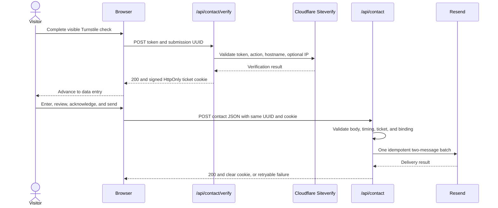

# Contact System

The Contact route is a statically exported page with two narrowly routed Cloudflare Pages Functions. Turnstile verification happens before contact data entry. A successful verification creates a short-lived signed ticket, and the later delivery request uses that ticket instead of submitting the Turnstile token again.

Use this guide for the complete request contract and trust boundary. See [Security](SECURITY.md) for the broader threat model, [Deployment](DEPLOYMENT.md) for production setup, and [Local development](LOCAL_DEVELOPMENT.md#complete-contact-flow-development) for local Pages Function testing.

## Source of truth

| Concern | Authoritative source |
| --- | --- |
| Static Contact route and metadata | `src/app/contact/page.tsx` |
| Wizard state, requests, retries, and acknowledgments | `src/components/contact/ContactForm.tsx` |
| Browser field validation | `src/components/contact/contactFormValidation.ts` |
| Turnstile widget options | `src/components/contact/TurnstileWidget.tsx` |
| Shared schemas, ticket, provider calls, and response headers | `functions/_shared/contact.ts` |
| Verification handler | `functions/api/contact/verify.ts` |
| Delivery handler | `functions/api/contact.ts` |
| Function route allowlist | `public/_routes.json` |
| Static response headers | `public/_headers` |
| Production and preview non-secret values | `wrangler.jsonc` |
| Build-time site-key selection | `.github/workflows/ci.yml` |

Implementation and configuration are authoritative when prose differs from the current code.

## Request lifecycle



The two endpoint calls use `credentials: "same-origin"`, so the browser can accept and later send the host-only ticket cookie. Contact fields are not included in the verification request.

## Client experience

### Route and first-step verification

`/contact` is static HTML with a hydrated client form. Its metadata is `noindex, follow`. The route reads `NEXT_PUBLIC_TURNSTILE_SITE_KEY` at build time. When the selected build has no site key, the widget is unavailable and Continue remains disabled.

The explicit Turnstile widget uses:

- action `portfolio_contact`;
- appearance `always`;
- flexible sizing;
- light widget styling only for the Light site theme, and dark styling for Navy and Dark;
- no hidden Turnstile response field because the token is sent in explicit JSON.

The widget script loads from Cloudflare after hydration. Expiry and timeout callbacks clear the token and offer a reset. Script, widget, and unsupported-browser errors fail closed in the client.

When the widget supplies a token, the browser creates a cryptographically random UUID. It posts only that UUID and the token to `/api/contact/verify`. A verified response resets the form start time, enables Continue, and advances to the name step after 400 milliseconds. Continue remains available during that delay as a manual fallback.

### Four wizard steps

The progress UI uses steps `0` through `3`:

1. Verify you are human.
2. Enter required first and last names.
3. Enter a required email address and message, plus an optional phone number.
4. Review the request and accept all three required acknowledgments.

The acknowledgments cover permission to respond, the Terms and Privacy Notice, and confirmation that the inquiry is legitimate and contains no prohibited material. The Send request button remains disabled until all three values are true and server verification is complete.

Draft contact values live only in React state. The contact form does not read or write local storage or session storage. The hidden `website` field is a honeypot. A direct `mailto:` link remains available when the form or delivery service cannot be used.

### Submission and retry states

The browser trims the visible text fields and sends the final JSON to `/api/contact`. It does not send the Turnstile token again.

After the first delivery attempt starts, the review Back button and acknowledgment controls are locked. A failed or uncertain retry therefore reuses the same submission UUID, `startedAt` value, acknowledgments, and byte-equivalent JSON payload. This matches Resend's requirement that a repeated idempotency key use the same request payload.

Client behavior depends on the response:

| Result | Client behavior |
| --- | --- |
| Verification succeeds | Advance to data entry and retain the UUID for delivery. |
| Verification fails or cannot be reached | Clear the UUID, reset the widget, remain at the gate, and offer direct email. |
| Delivery returns `verification_required` | Return to the gate, preserve the draft, unlock it for the new verified session, and create a new UUID. |
| Any other delivery or network failure | Stay on the locked review step and allow a same-payload retry with the current ticket and UUID. |
| Delivery succeeds | Show the receipt state, clear local draft state, and rely on the server response to clear the cookie. |

## Endpoint contract

Both handlers use the same request envelope rules:

- HTTP method must be `POST`. Other methods return `405` and `Allow: POST`.
- Required environment configuration is checked immediately after the method, before origin, media-type, or body validation.
- The media type, after removing parameters and normalizing case, must be `application/json`.
- The `Origin` header is mandatory and must exactly match a normalized configured origin. Missing, `null`, malformed, or unlisted origins are rejected. No wildcard and no CORS response are implemented.
- Both handlers enforce a 16,384-byte limit from `Content-Length` when present and from the bytes actually streamed. This happens before JSON parsing completes.
- The byte stream must be valid UTF-8 and valid JSON.
- A configured allowlist is valid only when every comma-separated entry is valid. One malformed origin or hostname makes the corresponding configuration check fail closed.

The handlers do not implement a request-body timeout, whole-request timeout, or client-side fetch timeout. Cloudflare platform limits still apply. Explicit timeouts exist only for the two outbound provider requests described below.

### `POST /api/contact/verify`

The body must be a plain object with exactly these two keys:

| Field | Requirement |
| --- | --- |
| `submissionId` | Trimmed UUID with a supported UUID version and standard variant. |
| `turnstileToken` | Trimmed, non-empty string of at most 2,048 characters without unsafe control characters. |

The handler checks required Turnstile configuration before origin, media-type, and body validation. It sends the token as JSON to `https://challenges.cloudflare.com/turnstile/v0/siteverify` with:

- the server-only secret;
- the token;
- the submission UUID as `idempotency_key`;
- `CF-Connecting-IP` as `remoteip` only when the header is non-empty, at most 64 characters, and free of unsafe control characters.

The Siteverify call has a 5-second timeout. A ticket is issued only when the provider response is successful, parses as JSON, contains `success: true`, contains action exactly `portfolio_contact`, and reports a hostname in the exact configured allowlist. The repository does not inspect provider error details or `challenge_ts`.

Cloudflare documents Turnstile tokens as single-use, valid for five minutes, and limited to 2,048 characters. See [Turnstile server-side validation](https://developers.cloudflare.com/turnstile/get-started/server-side-validation/).

### `POST /api/contact`

The delivery handler allows only the following keys. Unknown keys are rejected. The client always sends every key; the server permits `phone` to be omitted and normalizes it to an empty string.

| Field | Server requirement |
| --- | --- |
| `submissionId` | Required trimmed UUID matching the signed ticket. |
| `firstName` | Required trimmed text, at most 80 characters. |
| `lastName` | Required trimmed text, at most 80 characters. |
| `email` | Required trimmed address, at most 254 characters. It must have one `@`, a valid local part of at most 64 characters, and a dot-bearing DNS-style domain. |
| `phone` | Optional string, trimmed, at most 40 characters. A non-empty value may use the supported international-friendly character set and must contain 7 to 20 digits. |
| `message` | Required text, normalized to line-feed newlines, trimmed, and at most 3,000 characters. |
| `contactConsent` | Must be boolean `true`. |
| `legalConsent` | Must be boolean `true`. |
| `legitimateConsent` | Must be boolean `true`. |
| `startedAt` | Required safe integer timestamp in milliseconds. |
| `website` | Required honeypot string, at most 200 characters, and empty after trimming for a legitimate submission. |

Names, phone numbers, messages, and tokens reject unsafe ASCII control characters. Tabs and line endings remain available where their field grammar otherwise permits them. Email addresses reject all whitespace.

The handler evaluates the honeypot and timing signals while parsing the payload, before ticket validation:

- a non-empty honeypot returns generic `200 {"ok":true}` without email delivery;
- completion in less than 1,200 milliseconds returns the same generic success without email delivery;
- a timestamp more than 30 seconds in the future or more than two hours old is invalid;
- normal browser sessions are also limited by the shorter 30-minute verification ticket lifetime.

The silent success response prevents these low-cost bot signals from becoming a tuning oracle. It also means `200` is intentionally not proof that a honeypot or implausibly fast request produced email.

## Verification ticket

Successful Siteverify validation sets `__Host-portfolio_contact_ticket`. The cookie has:

- `Path=/`;
- `Max-Age=1800`;
- `Secure`;
- `HttpOnly`;
- `SameSite=Strict`;
- no `Domain` attribute, making it host-only.

The ticket payload contains only schema version `1`, the submission UUID, an issued-at timestamp, and an expiry timestamp. It contains no contact fields. The payload is signed, not encrypted, but its contents are opaque identifiers and timing metadata rather than the message or contact details.

The signing key is derived from `TURNSTILE_SECRET_KEY` with domain-separated HKDF-SHA-256, then used for HMAC-SHA-256. No additional ticket secret is configured. The delivery endpoint rejects an absent ticket, duplicate cookie name, malformed or non-canonical encoding, oversized ticket, wrong signature size, invalid signature, wrong version, future-issued ticket beyond the 30-second allowance, altered lifetime, expired ticket, or mismatched submission UUID.

The application has no server-side ticket store, consumed-ticket record, or revocation list. Successful delivery instructs the browser to clear the cookie. A failed delivery leaves it intact until expiry. Provider idempotency, the locked byte-equivalent retry payload, exact origin enforcement, and the short lifetime limit duplicate-delivery risk; they do not turn the ticket itself into a database-backed single-use credential. Rotating `TURNSTILE_SECRET_KEY` invalidates outstanding tickets.

## Email delivery and idempotency

After payload and ticket validation, the handler sends one JSON request to `https://api.resend.com/emails/batch` with server-only bearer authorization and an 8-second timeout. The batch has two messages:

| Message | Destination | Reply-to | Content |
| --- | --- | --- | --- |
| Owner notification | Private `CONTACT_RECIPIENT_EMAIL` | Validated visitor email | Name, email, optional phone, message, and acknowledgment summary. |
| Visitor receipt | Validated visitor email | Fixed public `CONTACT_REPLY_TO_EMAIL` | A copy of the submitted name, email, optional phone, and message, plus follow-up instructions. |

Both messages use the configured `CONTACT_FROM_EMAIL` sender and fixed subjects. User-controlled HTML is escaped before it enters the HTML templates. Plain-text alternatives are also sent. For the owner notification, the visitor controls only the validated `reply_to`; the sender, private owner destination, subject, and remaining headers are fixed.

The request header `Idempotency-Key` is `portfolio-contact/<submissionId>`. The application does not keep its own delivery ledger. Resend currently documents a 24-hour idempotency window for batch requests, returns the original result for an identical retry, and rejects reuse of the same key with a different payload. See [Resend idempotency keys](https://resend.com/docs/dashboard/emails/idempotency-keys).

Any network failure, timeout, or non-success provider response becomes `502 delivery_failed`. The handler does not parse or return provider response bodies or email identifiers.

## Responses and headers

| Condition | Status | JSON error |
| --- | ---: | --- |
| Unsupported method | `405` | `method_not_allowed` |
| Missing or invalid required configuration | `503` | `service_unavailable` |
| Missing, malformed, or unlisted origin | `403` | `request_rejected` |
| Media type other than JSON | `415` | `unsupported_media_type` |
| Body over 16 KiB | `413` | `request_too_large` |
| Malformed JSON or invalid schema | `400` | `invalid_request` |
| Turnstile rejection or provider verification failure | `400` | `verification_failed` |
| Missing, invalid, expired, or mismatched ticket | `401` | `verification_required` |
| Resend failure or timeout | `502` | `delivery_failed` |
| Accepted verification or delivery | `200` | none; body is `{"ok":true}` |
| Honeypot or implausibly fast delivery request | `200` | none; body is `{"ok":true}` without provider delivery |

Every Function response sets:

- `Cache-Control: no-store, max-age=0`;
- `Content-Type: application/json; charset=utf-8`;
- `Referrer-Policy: no-referrer`;
- `X-Content-Type-Options: nosniff`.

Cloudflare Pages does not apply `public/_headers` rules to Function-generated responses. Static pages receive the broader Content Security Policy, Permissions Policy, HSTS, framing, referrer, and content-type protections declared there. See [Cloudflare Pages custom headers](https://developers.cloudflare.com/pages/configuration/headers/).

## Configuration

### Browser build values

| Variable | Exposure and behavior |
| --- | --- |
| `NEXT_PUBLIC_TURNSTILE_SITE_KEY` | Public and compiled into the browser bundle. A blank value makes the form unavailable. |
| `NEXT_PUBLIC_TURNSTILE_PREVIEW_SITE_KEY` | GitHub repository variable used only by CI. The preview build maps it into `NEXT_PUBLIC_TURNSTILE_SITE_KEY`; application code does not read the preview name directly. |

Pull-request builds receive neither deployment site key. Production and preview builds do not fall back to one another.

### Function values

| Variable | Storage | Required by |
| --- | --- | --- |
| `TURNSTILE_SECRET_KEY` | Encrypted Cloudflare secret | Verification and ticket validation for delivery |
| `RESEND_API_KEY` | Encrypted Cloudflare secret | Delivery only |
| `CONTACT_RECIPIENT_EMAIL` | Encrypted Cloudflare secret | Delivery only |
| `TURNSTILE_ALLOWED_HOSTNAMES` | Reviewed Wrangler variable | Verification only |
| `CONTACT_ALLOWED_ORIGINS` | Reviewed Wrangler variable | Both endpoints |
| `CONTACT_FROM_EMAIL` | Reviewed Wrangler variable | Delivery only |
| `CONTACT_REPLY_TO_EMAIL` | Reviewed Wrangler variable | Delivery only |

`/api/contact/verify` can issue a ticket when delivery configuration is unavailable because it requires only the Turnstile secret, valid hostname allowlist, and valid origin allowlist. `/api/contact` does not need the hostname allowlist after a ticket exists, but it still needs the Turnstile secret to verify the ticket signature.

The production Wrangler values allow the assigned Pages hostname, the apex custom hostname, and its `www` hostname with matching HTTPS origins. The preview override allows only the stable `develop` Pages hostname and its HTTPS origin. Secret values are configured separately in Cloudflare and are not present in `wrangler.jsonc`, so the repository cannot prove that they exist or are correct in a live environment.

For local testing, copy the placeholder-only example into the ignored local environment file and follow [Local development](LOCAL_DEVELOPMENT.md#complete-contact-flow-development). Do not use production credentials locally.

## Abuse protection: enforced and external controls

### Enforced by repository code

- exact Function route allowlisting;
- POST-only JSON handlers;
- mandatory exact origin;
- streaming body-size and UTF-8/JSON validation;
- strict schemas and unknown-field rejection;
- required acknowledgments and field validation;
- honeypot and completion-time signals;
- one server-side Turnstile validation with exact action and hostname;
- signed, short-lived, submission-bound ticket;
- provider idempotency key and locked same-payload retries;
- generic, non-cacheable Function responses.

### External operator requirement

The repository contains no application rate limiter, rate-limit binding, `429` response path, or Cloudflare WAF ruleset. Production requires an operator-managed Cloudflare rate-limit rule covering both exact paths, normally counted by source IP:

```text
http.request.uri.path in {"/api/contact/verify" "/api/contact"}
```

The live WAF state cannot be verified from this repository. Confirm the deployed rule, threshold, counting characteristic, mitigation timeout, action, and response through the Cloudflare dashboard and a controlled live test.

Do not place an interactive Managed Challenge on either JSON endpoint. The form already performs one visible Turnstile check, and an HTML challenge would add a second gate and change the API response contract.

The browser falls back to a generic failure message when an error response is not valid JSON. That fallback does not make an HTML challenge compatible with the endpoint contract.

Cloudflare documents custom JSON rate-limit block responses as a Pro-plan-or-higher feature. If JSON blocks are required, confirm that the active plan and selected Block action support them. Do not claim a custom JSON edge response on a plan that cannot configure one. See [Cloudflare rate-limit custom responses](https://developers.cloudflare.com/waf/rate-limiting-rules/create-zone-dashboard/#configure-a-custom-response-for-blocked-requests).

## Privacy, storage, and logging

The application has no contact database or storage binding. The browser holds the draft in memory. The signed cookie holds only the submission UUID and timing metadata. Cloudflare processes request metadata and the verification token; Siteverify also receives the optional Cloudflare-provided IP value. Resend and the receiving mail systems process the complete email messages and delivery metadata. The visitor receipt repeats the submitted contact details in email.

There are no explicit `console` calls or request-body logging in the two Functions. This repository-level absence does not disable Cloudflare, Resend, or mailbox-provider logs and retention. Do not add body, token, contact-field, provider-response, recipient, or credential logging. Coarse outcomes and non-sensitive timing are the maximum appropriate application telemetry if logging is added later.

The private recipient is never returned in an endpoint response or included in the browser bundle. The configured sender and fixed reply-to are intentionally public identities and are not substitutes for the private destination inbox.

The direct email link bypasses the two contact Functions, their ticket, and their form-specific validation. Messages sent that way are processed directly by the visitor's and recipient's mail systems.

## Verification coverage and limits

The automated tests cover browser gating, exact client request bodies, locked retries, field validation, Turnstile widget callbacks, handler order, body and schema rejection, origin and configuration failure, ticket signing and tamper checks, provider calls, email escaping, idempotent retry, route allowlisting, and legal-page disclosures.

Deployment smoke testing performs unauthenticated `GET` requests to both Function paths and requires `405` JSON responses. This proves that both routes are deployed and reject the wrong method. It does not prove live Turnstile validation, cookie acceptance, WAF state, Resend delivery, sender-domain verification, recipient correctness, or mailbox receipt.

Useful focused verification:

```powershell
npx --no-install vitest run functions/api/contact/verify.test.ts functions/api/contact.test.ts src/app/contact/contact.test.tsx src/components/contact/TurnstileWidget.test.tsx src/components/contact/contactFormValidation.test.ts
npm run docs:check
```

Complete end-to-end activation still requires a controlled live test on each allowed hostname without printing tokens, contact bodies, recipient values, or provider responses.

## Change rules

When changing either endpoint or the client contract:

1. Update browser and server schemas together.
2. Preserve exact route scoping in `public/_routes.json`.
3. Reassess origin, body, timing, ticket, privacy, logging, and rate-limit behavior.
4. Keep secrets server-only and public site keys environment-specific.
5. Add tests for success, failure, retry, timeout, and generic responses.
6. Update this guide, [Security](SECURITY.md), [Deployment](DEPLOYMENT.md), and the [Security checklist](SECURITY_CHECKLIST.md).
7. Verify the active Cloudflare and Resend configuration separately from repository tests.
