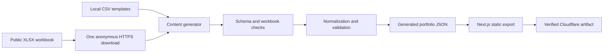

# Content Pipeline

Smart Portfolio turns spreadsheet rows into validated JSON before Next.js renders any portfolio page. The browser never downloads or parses the workbook. Deployable content is fetched, validated, built, and deployed as one immutable candidate snapshot.

Use this guide for source selection, generation, hashing, and deployment semantics. See [Content Sheet Schema](CONTENT_SHEET_SCHEMA.md) for the exact columns and field rules, [Content Mapping](CONTENT_MAPPING.md) for selectors and UI consumers, and [Local Content Editing](LOCAL_CONTENT_EDITING.md) for the editing workflow.

## Pipeline overview



The generator is `scripts/fetchPortfolioContent.ts`. Workbook-specific checks and content hashing live in `scripts/lib/portfolioContentGeneration.ts`. Shared normalization and content validation live under `src/lib/content/`.

## Source modes

Two environment variables control source selection:

- `PORTFOLIO_WORKBOOK_URL`: one anonymously downloadable HTTPS XLSX URL.
- `PORTFOLIO_REQUIRE_REMOTE_CONTENT`: strict-mode switch. Only the exact string `true` enables it.

The current generator behaves as follows:

| Workbook URL | Strict mode | Result |
| --- | --- | --- |
| Blank | `false` or unset | Read all checked-in CSV templates. |
| Blank | `true` | Fail before reading templates. |
| Present and valid | Either value | Download and use all nine workbook tabs. |
| Present but invalid, unavailable, or malformed | Either value | Fail without template fallback. |

There is no per-sheet URL, CSV download mode, or per-tab fallback. Supplying a workbook URL selects the remote path for the complete public workbook. A failed configured download never falls back to local content, even when strict mode is false.

Generated metadata declares `sourceMode` as `templates` when all nine public sheets are local and `remote` when all nine come from the workbook. The type also permits `mixed`, but the current all-or-nothing public source selection cannot emit that mode.

The generator also requires the checked-in `resume.csv` compatibility template to remain header-only. It reads that local guard file in both source modes, never downloads resume content, and never accepts a `resume` worksheet in the remote workbook.

When the command runs directly, it loads the ignored root `.env` file if present. Existing process environment values and the tracked `.env.example` define the supported configuration boundary.

## Remote download boundary

The remote path makes exactly one request for the complete workbook:

- The URL must use HTTPS and must not contain a username or password.
- Fetch credentials are omitted, redirects are followed, and no authorization or cookie header is added.
- The request advertises XLSX and generic binary responses through `Accept`.
- The fixed timeout is 15 seconds.
- The maximum response size is 5 MiB. A non-empty `Content-Length` must parse as a non-negative safe integer or generation fails. The declared size and the streamed or fallback body size are each enforced.
- A non-success HTTP status fails generation with a generic error that does not include the configured URL.

Payload validation rejects a `text/html` response type, common HTML or login content at the start of the body, and data without a ZIP signature. ExcelJS must then parse the bytes as a valid, non-empty XLSX workbook. The response MIME type is not an allowlist by itself. A non-HTML MIME type can proceed only when the ZIP and XLSX checks also succeed.

The workbook is intentionally anonymous public input. Secret storage in GitHub Actions is used for runner-log redaction, not authentication.

## Workbook structure checks

The workbook must contain exactly these nine visible tabs:

1. `profile`
2. `links`
3. `research`
4. `projects`
5. `experience`
6. `recommendations`
7. `education`
8. `skills`
9. `site_settings`

Each title is matched with `title.trim().toLowerCase()`. Capitalization, surrounding whitespace, and physical tab order do not matter. Internal spaces, punctuation, hyphens, and spelling are not normalized aliases.

Generation rejects:

- a missing or unexpected tab;
- an explicit `resume` tab;
- duplicate normalized tab names;
- hidden or very-hidden tabs;
- any workbook whose total tab count is not exactly nine.

Each worksheet is limited to 5,000 rows, 128 columns, and 250,000 row-by-column cells. These limits are checked against ExcelJS worksheet dimensions before row conversion.

## Headers, rows, and formulas

Every sheet has an exact header set defined in `scripts/lib/portfolioContentGeneration.ts` and documented in [Content Sheet Schema](CONTENT_SHEET_SCHEMA.md). Header order is flexible, but header names are trimmed, case-sensitive, unique, and must match the required lowercase set exactly. Extra or missing headers fail generation.

Row conversion uses displayed cell text:

- Empty rows and harmless trailing blank rows or columns are ignored.
- A non-empty cell beyond the declared schema is a malformed row.
- Windows and legacy carriage-return line endings normalize to `\n`.
- Outer whitespace is trimmed during CSV-compatible parsing and field normalization. Meaningful internal whitespace is preserved.
- Formula cells are accepted only when the workbook contains a cached result. The displayed cached text is used. A formula without a cached result fails generation.

The `profile` and `site_settings` workbook tabs accept only their explicit key allowlists and reject duplicate keys.

Local CSV templates use the same exact headers and row normalization. The local parser does not apply the workbook-only unknown-key and duplicate-key checks for `profile` and `site_settings`, so authors should still treat the remote allowlists as the contract. Collection IDs are validated in both modes.

## Normalization and validation

Generation applies four layers:

1. Parse and validate the exact CSV-equivalent sheet structure.
2. Normalize keys, booleans, numbers, lists, links, optional values, and supported date settings.
3. Validate required fields, unique IDs, references, grouped fields, URLs, and content invariants.
4. Import and validate the generated JSON again through `getPortfolioContent()` during the static build.

Important normalization rules include:

- Blank optional text becomes absent from JSON.
- Blank list fields become empty arrays.
- Pipe-delimited items are trimmed and empty items are removed.
- Booleans accept `true`, `false`, `yes`, `no`, `1`, and `0`, case-insensitively. A blank row boolean defaults to `false`.
- Numbers must be finite, but the normalizer does not require integers or non-negative values.
- `legal_effective_date` accepts a real ISO date or converts a valid `M/D/YYYY` or `MM/DD/YYYY` display value to ISO before validation.
- Other date-like content fields remain strings. Their recommended formats are UI conventions, not generator-level calendar validation.
- Project Home skills accept at most three ordered entries and require each optional summary/details pair together.
- Skill popup copy requires `proficiency`, `summary`, and `where_used` together.
- Recommendation source, LinkedIn, and inline quote destinations require HTTPS.
- Profile role rotation requires all three role fields together and at least one non-empty pipe-delimited prefix.

See [Content Sheet Schema](CONTENT_SHEET_SCHEMA.md) for field-specific requirements and URL rules.

## Generated JSON

Generation writes `src/content/generated/portfolio.generated.json`. An abridged structure is:

```json
{
  "metadata": {
    "generatedAt": "<ISO timestamp>",
    "contentHash": "<SHA-256>",
    "sourceMode": "templates or remote",
    "sources": {
      "profile": "template or remote"
    }
  },
  "profile": {},
  "links": [],
  "research": [],
  "projects": [],
  "experience": [],
  "recommendations": [],
  "education": [],
  "skills": [],
  "siteSettings": {}
}
```

The abbreviated `sources` example shows one representative public entry.

The generated file is always rewritten in formatted JSON, including when its semantic hash is unchanged. Pages import it statically through `src/lib/content/getPortfolioContent.ts`; there is no browser workbook fetch or runtime content API.

The repository tracks the local template snapshot so a clone can build without remote configuration. Strict remote workbook snapshots are different: GitHub Actions generates them only in its candidate workspace and deploys the tested static artifact without committing that remote snapshot.

## Content hash

`contentHash` is a SHA-256 digest of a canonical normalized content subset. Object keys are sorted recursively, `undefined` properties are removed, and array order is preserved. All metadata is excluded.

The implementation also excludes fields confirmed to have no current consumer effect:

| Object | Excluded fields |
| --- | --- |
| `profile` | `previousExperienceId`, `primaryCtaLabel`, `secondaryCtaLabel` |
| `siteSettings` | `maxHomeExperienceItems` |
| Each `education` item | `homeSummary`, `detailSummary`, `detailOrder` |

Every other normalized field is included, even if a current component does not consume it. Row order also remains part of the digest because arrays are not re-sorted for hashing. The precise description is a hash of the canonical normalized content subset, not a byte hash of the workbook.

Workbook file metadata, worksheet order, title capitalization, header order, source metadata, download time, line-ending representation, and `generatedAt` do not affect the hash after normalization. A change that normalizes to the same included JSON has the same hash.

## `generatedAt` and semantic change detection

The generator calculates the new hash, then compares it with `metadata.contentHash` in the existing output file:

- A matching valid lowercase 64-character hash produces `contentChanged=false`.
- On an unchanged hash, a non-empty previous `generatedAt` value is preserved.
- On an unchanged hash with a missing, blank, or non-string previous `generatedAt`, `contentChanged` remains false but the requested generation time is used.
- A missing output, legacy output without a valid hash, or different hash produces `contentChanged=true` and uses the requested generation time.
- Invalid existing JSON fails generation rather than being silently replaced.

The script logs and, when `GITHUB_OUTPUT` is set, exports `content_changed`, `content_hash`, and `generated_at`.

Preservation is relative to the existing local output file. CI starts from the committed template snapshot, so a strict remote candidate can receive a new `generatedAt` even when its remote hash matches the active deployment. Deployment decisions therefore compare `contentHash`, not `generatedAt`.

## Build and deployment use

The package scripts deliberately separate generation from candidate consumption:

- `npm run generate:content` generates JSON from the selected source.
- `npm run build` runs `prebuild`, regenerates content, creates the static export, and writes `out/content-version.json`.
- `npm run build:generated` consumes the existing generated JSON without another workbook download, then writes `out/content-version.json`.

Pull requests generate from local templates without remote credentials. Current `main` and `develop` pushes, scheduled checks, and manual deployment candidates use strict remote mode. The verify job downloads once, tests and builds that snapshot, creates an integrity manifest, and uploads the exact `out/` artifact. The deploy job downloads and verifies the artifact without rebuilding or fetching content again.

`out/content-version.json` contains only:

- schema version;
- content hash;
- exact candidate commit SHA;
- generated timestamp;
- deployment timestamp.

Scheduled and non-forced manual checks compare the candidate hash with the active production manifest. An unchanged hash is a successful no-op before lint, tests, build, artifact upload, and deployment. A failure before Wrangler Direct Upload does not change the active target. Once Wrangler returns successfully, a later smoke failure can mean the new deployment is already active; the workflow does not roll it back automatically.

See [Deployment](DEPLOYMENT.md) for branch, artifact, Cloudflare, and rollback behavior.

## Authoritative sources

| Concern | Authoritative source |
| --- | --- |
| Generated model | `src/content/types.ts` |
| Local source headers | `src/content/templates/*.csv` |
| Source selection and download limits | `scripts/fetchPortfolioContent.ts` |
| Workbook tabs, headers, formulas, and hash | `scripts/lib/portfolioContentGeneration.ts` |
| CSV parsing | `src/lib/csv/parseCsv.ts` |
| Field normalization | `src/lib/content/normalizePortfolioContent.ts` |
| Content validation and URL policy | `src/lib/content/validatePortfolioContent.ts` |
| Runtime generated-content import | `src/lib/content/getPortfolioContent.ts` |
| Home and detail selectors | `src/lib/content/selectHomeContent.ts` |
| Ordering | `src/lib/content/sortPortfolioContent.ts` |
| Content generation tests | `scripts/portfolioContentGeneration.test.ts` |
| Mapping and selector tests | `src/lib/content/content.test.ts` |
| Candidate and deployment flow | `.github/workflows/ci.yml` |
| Deployed content manifest | `scripts/writeContentVersion.mjs` |

## Verification

After changing content contracts or generator behavior, run:

```powershell
npm run generate:content
npm run typecheck
npm run test -- scripts/portfolioContentGeneration.test.ts src/lib/content/content.test.ts
npm run build
```

Run the repository-wide `npm run verify` before merge. Do not edit generated JSON by hand.
