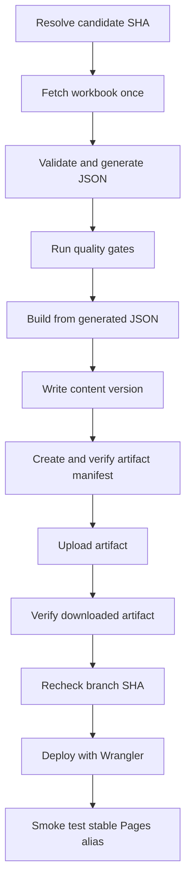

# Deployment

Smart Portfolio is deployed to Cloudflare Pages by GitHub Actions. The repository produces a Next.js static export and supplies two Cloudflare Pages Functions at `/api/contact/verify` and `/api/contact`.

This guide defines the deployment architecture and initial configuration. Use [Operations](OPERATIONS.md) for recurring releases, monitoring, rollback, and incident response. Use [Troubleshooting](TROUBLESHOOTING.md) when a local or hosted check fails.

## Current deployment targets

| Purpose | Address | Repository use |
| --- | --- | --- |
| Public custom domain | `https://nicolasmgioanni.dev` | Primary visitor address |
| Cloudflare-assigned production domain | `https://smart-portfolio-bds.pages.dev` | Production polling and smoke tests |
| Stable `develop` preview | `https://develop.smart-portfolio-bds.pages.dev` | Preview polling and smoke tests |

HTTP checks on 2026-08-27 observed successful responses from the public custom domain and both `pages.dev` targets. This is a point-in-time observation, not repository verification of current domain, DNS, certificate, or Pages state. The workflow deliberately uses the assigned Pages domain for automation so a custom-domain or DNS change cannot redirect deployment verification.

`www.nicolasmgioanni.dev` is present in the production hostname and origin allowlists. Domain attachment, redirect behavior, TLS state, and DNS records are Cloudflare account configuration rather than repository configuration and must be checked separately.

## Ownership and trust boundaries

The checked-in deployment path is `.github/workflows/ci.yml`. It builds and deploys through Wrangler Direct Upload. There is no Vercel, Netlify, or Cloudflare Git-integration configuration in the repository.

The repository can verify:

- Workflow triggers, job permissions, conditions, and commands.
- The exact Pages project name and assigned domain required by the workflow.
- Static output, Function routing, security headers, content-version metadata, and artifact-integrity logic.
- That deployment credentials are requested only by the deploy job.

The repository cannot verify Cloudflare or GitHub dashboard state. Operators must separately confirm:

- Cloudflare Pages Git integration remains disconnected.
- No legacy provider continues to publish the custom domain.
- Cloudflare runtime secrets exist in the correct production and preview environments.
- WAF rate limiting covers both contact endpoints, and the selected Cloudflare plan or provider-compatible control preserves the JSON API contract.
- `main` branch protection requires the `verify` check and blocks force-push and deletion.
- Custom-domain bindings, redirects, certificates, and DNS remain healthy.

Provider-dashboard uploads and deploy hooks bypass the repository quality gate and are not part of the supported release path.

## Trigger and branch behavior

The workflow has one verification job, one conditional deploy job, and one schedule-only heartbeat job.

| Event | Candidate | Content source | Full verification | Deployment |
| --- | --- | --- | --- | --- |
| Pull request targeting `main` or `develop` | Event SHA | Checked-in templates | Always | Never |
| Push to `develop` | Exact pushed SHA, if still current | One strict workbook snapshot | Always for the latest candidate | `develop` preview |
| Push to `main` | Exact pushed SHA, if still current | One strict workbook snapshot | Always for the latest candidate | Production |
| Daily schedule at `17 13 * * *` | Current `main` | One strict workbook snapshot | Only when the production content hash differs | Production only when changed |
| Manual dispatch, `force_deploy=true` | Current `main` | One strict workbook snapshot | Always | Production |
| Manual dispatch, `force_deploy=false` | Current `main` | One strict workbook snapshot | Only when the production content hash differs | Production only when changed |

`force_deploy` is a required boolean input and defaults to `true`. It bypasses only the unchanged-content optimization. It does not bypass content validation, documentation validation, lint, typecheck, tests, build, artifact verification, current-branch checks, Wrangler, or post-deployment smoke checks.

Scheduled and manual runs explicitly check out `main`, regardless of the branch shown in the dispatch interface. Push candidates use the pushed branch. Pull requests set no deployment branch and build a verification-only template snapshot.

For any non-PR candidate, the verify job fetches the current remote branch tip and compares it with the checked-out SHA. A stale candidate produces no build artifact and no deployment. The deploy job repeats that branch-tip comparison immediately before Wrangler runs.

## Permissions and credentials

The workflow-level permission is:

```yaml
permissions:
  contents: read
```

The verify and deploy jobs therefore have read-only repository access. Cloudflare deployment authority comes from the restricted API token passed directly to Wrangler, not from a GitHub repository write permission.

The schedule-only heartbeat job is the sole exception. It declares `contents: write` and can update only `.github/schedule-heartbeat` on the isolated `automation-heartbeat` branch after the inactivity threshold is met.

### GitHub repository variables

| Variable | Required value or purpose |
| --- | --- |
| `CLOUDFLARE_PAGES_PROJECT_NAME` | Must equal `smart-portfolio` |
| `CLOUDFLARE_PAGES_DOMAIN` | Must equal `smart-portfolio-bds.pages.dev` |
| `NEXT_PUBLIC_TURNSTILE_SITE_KEY` | Public production widget key compiled into the production build |
| `NEXT_PUBLIC_TURNSTILE_PREVIEW_SITE_KEY` | Optional public preview widget key, with no production fallback |

The workflow fails before downloading the workbook if either Pages target variable differs from the reviewed value.

### GitHub Actions secrets

| Secret | Purpose |
| --- | --- |
| `PORTFOLIO_WORKBOOK_URL` | Anonymous HTTPS XLSX source, stored as a secret for runner-log redaction |
| `CLOUDFLARE_API_TOKEN` | Restricted Cloudflare token with Pages edit authority |
| `CLOUDFLARE_ACCOUNT_ID` | Target Cloudflare account identifier |

The workbook source is supplied only to non-PR content generation. Cloudflare deployment secrets are supplied only to the deploy job.

### Cloudflare runtime secrets

Configure these as encrypted Pages secrets for each environment that supports the contact flow:

- `TURNSTILE_SECRET_KEY`
- `RESEND_API_KEY`
- `CONTACT_RECIPIENT_EMAIL`

Do not add a separate verification-ticket key. The Function derives its signing key from `TURNSTILE_SECRET_KEY` with domain-separated HKDF.

### Reviewed non-secret Pages variables

`wrangler.jsonc` is the source of truth for:

- `TURNSTILE_ALLOWED_HOSTNAMES`
- `CONTACT_ALLOWED_ORIGINS`
- `CONTACT_FROM_EMAIL`
- `CONTACT_REPLY_TO_EMAIL`

The top-level values cover production. `env.preview.vars` narrows the preview environment to the stable `develop` hostname and origin. The file also pins `pages_build_output_dir` to `./out` and the Cloudflare compatibility date.

## Initial environment setup

The tracked workflow is configured to use Cloudflare Pages Direct Upload. The current Cloudflare dashboard state is external and unverified by the repository. These steps define the required state when rebuilding the configuration in a new account or auditing the existing one.

1. Use a Pages Direct Upload project named `smart-portfolio` with production branch `main`. Do not create a second project to match the assigned `smart-portfolio-bds.pages.dev` hostname.
2. Keep Cloudflare Git integration disconnected. GitHub Actions owns the content fetch, quality gate, build, and upload.
3. Add the four repository variables and three Actions secrets listed above.
4. Apply the reviewed non-secret values from `wrangler.jsonc` and configure encrypted runtime secrets separately for production and preview.
5. Configure the Turnstile widgets for their exact production or preview hostnames. Production credentials must not authorize local-development hosts.
6. Verify the Resend sending identity and keep the recipient value server-only.
7. Configure external WAF rate limiting for both JSON endpoints. A combined expression may match:

   ```text
   http.request.uri.path in {"/api/contact/verify" "/api/contact"}
   ```

   Count by source IP. A Free-plan baseline of 5 requests per 10 seconds with a 10-second block can reduce abuse, but Cloudflare custom rate-limit responses require Pro or higher. Free-plan rate limiting therefore cannot guarantee the required `application/json` response and must not be documented as fully satisfying the contact API contract. On Pro or higher, explicitly configure the rate-limit or block action for both endpoints with the required JSON response and verify the live status, content type, and body. Plan eligibility alone does not satisfy the prerequisite. Otherwise, use another provider-compatible control that preserves the JSON contract. Do not use an interactive Managed Challenge on either endpoint.
8. Confirm the active custom-domain, redirect, DNS, and TLS state in Cloudflare. The repository allowlists do not attach a domain.
9. Run a manual dispatch with `force_deploy=true`, then perform the automated and manual checks described below.

The WAF rule, active Cloudflare plan, runtime secret presence, branch protection, and provider integration state are external prerequisites. Their desired values are documented here, but their current live state is unverified by the tracked files.

## Strict content input

Non-PR candidates set `PORTFOLIO_REQUIRE_REMOTE_CONTENT=true` and perform one anonymous workbook download. The generator does not receive Google account access, OAuth tokens, a service account, a Drive connector, or a Sheets API client.

The workbook must expose exactly the nine expected visible worksheets. The generator rejects missing, extra, duplicate-normalized, hidden, or very-hidden worksheets, malformed headers or rows, invalid file data, schema validation failures, timeouts, and responses above the configured size limit. Strict mode has no template fallback.

Pull requests do not receive the workbook source. They generate and validate content from the checked-in templates.

See [Content Pipeline](CONTENT_PIPELINE.md) and [Content Sheet Schema](CONTENT_SHEET_SCHEMA.md) for the complete workbook and normalization contract.

## One-fetch, exact-artifact pipeline



`npm run build:generated` invokes Next.js and the content-version writer without running the `prebuild` content generator. This is what makes the CI path a one-fetch pipeline. The deploy job does not rebuild or download the workbook.

The verify job runs these required checks against the candidate snapshot:

1. Documentation integrity.
2. ESLint with zero warnings.
3. TypeScript typecheck.
4. Focused footer regression tests.
5. The full Vitest suite.
6. The static build.

For production and preview builds, `DEPLOYMENT_COMMIT_SHA` binds deployment metadata to the candidate. Production receives only the production Turnstile site key. Preview receives only the optional preview key.

The deploy job checks out the same SHA so `functions/` and `wrangler.jsonc` match the tested source. It installs the locked local Wrangler version with `npm ci`, downloads the verified `out/` artifact, validates it, rechecks the branch tip, and runs Wrangler from the repository root.

## Deployment metadata

### Content version

Every build writes `out/content-version.json` with exactly five fields:

```json
{
  "schemaVersion": 1,
  "contentHash": "<sha256>",
  "commitSha": "<40-character Git SHA>",
  "generatedAt": "<content generation timestamp>",
  "deployedAt": "<build timestamp>"
}
```

The `contentHash` covers the canonical normalized content subset and excludes volatile metadata. When that canonical subset is unchanged, generation preserves `generatedAt`. Scheduled and non-forced manual decisions compare only this content hash with the active production manifest.

`public/_headers` marks `/content-version.json` as non-cacheable. The comparison request also sends no-cache headers, adds a cache-busting query, treats `404` as no prior deployment, and fails closed on other inaccessible or malformed responses.

### Artifact integrity

Before upload, `scripts/artifactIntegrity.mjs` creates `out/artifact-integrity.json`. It records:

- Schema version `1`.
- Algorithm `sha256`.
- The candidate commit SHA.
- A sorted record for every other artifact file, including its relative path, byte size, and SHA-256 digest.

The creator rejects symbolic links and unsupported entries. Verification requires the expected commit SHA, agreement with `content-version.json`, the same file count and ordered paths, and exact size and digest matches. The verify job validates the manifest before upload, and the deploy job validates the downloaded artifact again. Hidden export files are included. The Actions artifact is named `cloudflare-pages-build` and is retained for one day.

The integrity manifest covers `out/`. The Pages Functions are source-bound through the exact candidate checkout and branch recheck rather than being copied into that static artifact.

## Exact automated smoke scope

After Wrangler returns, `scripts/checkDeployedContent.mjs` tests the stable assigned-domain alias for the deployed branch. It retries up to 10 times, waits 5 seconds between attempts, uses cache-busting queries, and applies a 20-second timeout to each request.

Each successful attempt proves:

1. `/` returns a successful response whose content type includes `text/html`.
2. `/content-version.json` contains the expected content hash and candidate commit SHA.
3. `/artifact-integrity.json` exactly matches the verified local manifest.
4. `GET /api/contact/verify` returns HTTP `405`, an `application/json` content type, and `{ "ok": false, "error": "method_not_allowed" }`.
5. `GET /api/contact` returns the same exact method-rejection contract.

The automated smoke test does not request every static route, test the custom domain, inspect the static security headers, submit a valid Turnstile token, send email, exercise WAF rules, or prove end-to-end contact delivery. Those checks remain part of release and operations verification.

## Routing and response headers

`public/_routes.json` invokes Pages Functions only for:

- `/api/contact/verify`
- `/api/contact`

All other route and asset requests remain on the static Pages path. `public/_headers` supplies the static Content Security Policy, permissions policy, referrer policy, HSTS, content-type protection, frame denial, and the non-cache rules for both public metadata files.

Pages `_headers` rules do not apply to Function responses. Both Functions set their own JSON content type, no-store caching, referrer, and content-type-sniffing headers.

## Failure and rollback behavior

Failure behavior depends on where the run stops:

- A stale candidate, invalid target, content failure, quality-gate failure, build failure, artifact failure, or pre-Wrangler branch mismatch does not change the active Pages deployment.
- A Wrangler failure normally leaves the prior successful deployment active, but the Cloudflare result remains authoritative.
- A smoke failure occurs only after Wrangler has successfully created the candidate deployment. The candidate may already be serving through the stable alias, and a failed GitHub job does not undo or roll back that upload. Identify the active deployment from Cloudflare history and live metadata before taking recovery action.
- A changed workbook hash that fails before deployment differs from the active manifest, so a later scheduled run attempts it again.
- A code-only candidate can have the same content hash as production. If its push deployment fails, a later non-forced content check can be a no-op. Use a forced manual dispatch to retry that source revision after correcting the failure.

The one-day GitHub artifact is not a long-term rollback archive. Use Cloudflare Pages deployment history for an authorized provider rollback, or restore the intended source and workbook state and perform a forced green deployment. After either path, verify both assigned and custom domains and record the active content and commit metadata.

See [Operations](OPERATIONS.md) for the release, incident, and rollback runbooks.

## Branch protection and heartbeat

The intended `main` protection policy is:

1. Pull-request-based changes with the `verify` status required.
2. The branch must be current before merge.
3. Force-push and branch deletion are blocked.
4. GitHub Actions has no bypass to write deployment state to `main`.

This policy must be checked in GitHub settings because it is not encoded by the workflow.

The daily schedule also starts `automation-heartbeat`. It compares the newest activity on `main` and the isolated heartbeat branch. If neither has activity within 30 days, it writes only `.github/schedule-heartbeat`, verifies that no other path changed, commits as `github-actions[bot]`, and pushes only `automation-heartbeat`. The job uses its own non-canceling concurrency group and cannot deploy.

## Related guides

- [Operations](OPERATIONS.md)
- [Testing](TESTING.md)
- [Troubleshooting](TROUBLESHOOTING.md)
- [Security](SECURITY.md)
- [Architecture](ARCHITECTURE.md)
- [Local Development](LOCAL_DEVELOPMENT.md)
