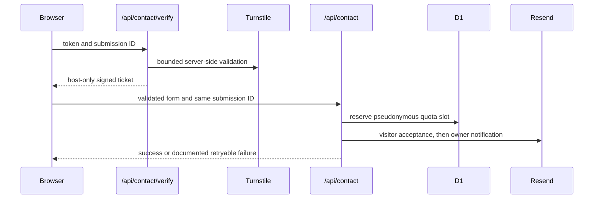

# Implementation inventory

This guide is the compact reconciliation map for the checked-in Smart Portfolio implementation. It identifies the source that owns each contract and distinguishes repository evidence from information that must be observed in an operator console or a deployed environment. It complements, rather than repeats, the detailed guides linked below.

## Reading status correctly

Use these terms consistently when documenting or reviewing the system:

| Status | Meaning | Evidence |
| --- | --- | --- |
| Implemented | The behavior is defined by tracked source and can be exercised locally. | The named source, its focused tests, and an appropriate local command. |
| Repository-declared | The repository records an intended workflow or configuration value. | Tracked workflow, configuration, migration, or public header file. |
| Operator-managed | A required setting lives outside the repository. | A controlled dashboard, provider, or deployment check; source alone cannot prove it. |
| Historical evidence | A dated review record or provenance artifact explains a past decision. | The record itself; it does not establish current runtime state. |
| Proposed | A change is intentionally not implemented yet. | It must be labelled as proposed and must not be described as a current contract. |

For example, `wrangler.jsonc` declares the intended Pages and D1 bindings, while the existence of a matching remote binding, secret, WAF rule, custom-domain setting, or successful deployment is operator-managed. The deployment workflow can test some of those facts during a run, but a passing local build cannot.

## System ownership

| Contract | Authoritative implementation | What the code owns | Detailed guide |
| --- | --- | --- | --- |
| Static export | `next.config.mjs`, `scripts/nextBuildAdapter.mjs`, `scripts/normalizeNextStaticExport.mjs` | Next static export, unoptimized images, and the guarded post-export normalization for generated segment-cache paths. | [Architecture](ARCHITECTURE.md), [Deployment](../operations/DEPLOYMENT.md) |
| Routes and shell | `src/app/`, `src/app/layout.tsx`, `src/lib/routing/siteRoutes.ts`, `src/components/layout/` | Static pages, metadata entry points, route registry, shell, header, footer, and no-script route fallbacks. | [Project structure](PROJECT_STRUCTURE.md) |
| Portfolio presentation | `src/components/portfolio/`, `src/components/overlay/`, `src/components/glass/`, `src/components/theme/`, `src/components/motion/` | Server-composed portfolio surfaces and narrowly scoped browser interaction. Shared modal and theme write contracts remain centralized. | [Design system](../design/DESIGN_SYSTEM.md), [Accessibility](../design/ACCESSIBILITY.md) |
| Content model | `src/content/types.ts`, `src/content/templates/`, `src/lib/content/`, `src/lib/csv/` | Typed public-content shapes, normalization, validation, selection, ordering, metadata, and presentation-safe resolvers. | [Content pipeline](../content/CONTENT_PIPELINE.md), [Content mapping](../content/CONTENT_MAPPING.md) |
| Content generation | `scripts/fetchPortfolioContent.ts`, `scripts/lib/portfolioContentGeneration.ts`, `scripts/lib/workbookArchive.ts` | Local-template and strict-workbook modes, payload limits, schema checks, generated snapshot, and canonical content hash. | [Content pipeline](../content/CONTENT_PIPELINE.md) |
| Local project visuals | `src/lib/projects/`, `src/components/portfolio/projects/`, `public/images/projects/` | Local visual metadata and accessible visual views for established workbook project records. The workbook still owns records and ordering. | [Project showcase](../content/PROJECT_SHOWCASE.md) |
| Contact runtime | `functions/api/`, `functions/_shared/contact/`, `migrations/`, `src/components/contact/` | The two Pages Functions, browser flow, strict request handling, signed verification ticket, pseudonymous D1 reservation, and provider calls. | [Contact system](../security/CONTACT_SYSTEM.md) |
| Runtime routing and headers | `public/_routes.json`, `public/_headers`, `wrangler.jsonc` | The exact Function allowlist, static response headers, Pages output directory, reviewed non-secret values, and D1 binding declarations. | [Security](../security/SECURITY.md), [Deployment](../operations/DEPLOYMENT.md) |
| Verification and release | `.github/workflows/ci.yml`, `scripts/runValidationTier.mjs`, `scripts/artifactIntegrity.mjs`, `scripts/checkDeployedContent.mjs`, `scripts/writeContentVersion.mjs` | Candidate selection, test tiers, content and artifact metadata, artifact transfer checks, deployment commands, and bounded smoke checks. | [Testing](../quality/TESTING.md), [Operations](../operations/OPERATIONS.md) |

There is no `src/features/` layer in this repository. Portfolio domains belong in `src/components/portfolio/`; content transformation and selection belong in `src/lib/content/`; reusable presentation primitives remain under `src/components/`; and route composition belongs in `src/app/`.

## End-to-end paths

### Public portfolio content

```mermaid
flowchart LR
    Source[Checked-in CSV templates or one XLSX workbook] --> Generate[scripts/fetchPortfolioContent.ts]
    Generate --> Validate[Normalization and validation]
    Validate --> Snapshot[src/content/generated/portfolio.generated.json]
    Snapshot --> Content[src/lib/content selectors and resolvers]
    Content --> Routes[src/app and src/components/portfolio]
    Routes --> Export[out static export]
```

The browser receives rendered content and hydrates only interaction boundaries. It does not fetch the workbook or a runtime portfolio-content API. The generated JSON is an output: edit a template or the approved workbook source, then regenerate it.

### Contact request

The exact field, response, retry, storage, and header contracts live in [Contact system](../security/CONTACT_SYSTEM.md). Turnstile, DNS, D1, Resend, WAF, encrypted secrets, and mail acceptance are external boundaries; local tests use controlled doubles or local emulation where documented.

## Configuration placement

| Configuration class | Checked-in location | Runtime placement | Do not place here |
| --- | --- | --- | --- |
| Local developer values | `.env.example` documents names only | Ignored `.env` | A committed secret or production credential |
| Public build value | `NEXT_PUBLIC_TURNSTILE_SITE_KEY` is consumed at build time | GitHub repository variable for deployable builds; local `.env` for local work | A server secret or recipient address |
| Function secret | Names documented in `.env.example` and [Contact system](../security/CONTACT_SYSTEM.md) | Encrypted Cloudflare secret | `wrangler.jsonc`, a public build variable, or client code |
| Reviewed non-secret Function policy | `wrangler.jsonc` | Pages environment configuration shipped with the deployment | A secret-bearing configuration file |
| D1 schema | `migrations/` | The selected remote database after workflow migration; local Wrangler state for local work | A hand-edited production table |
| Static security routing | `public/_routes.json` and `public/_headers` | Files copied into the static artifact | Function response headers, which handlers set separately |

Use [Local development](../development/LOCAL_DEVELOPMENT.md) for safe setup and [Deployment](../operations/DEPLOYMENT.md) for the release-specific placement and restoration procedure.

## Failure and recovery ownership

| Boundary | Local evidence or failure signal | Safe recovery owner | Avoid |
| --- | --- | --- | --- |
| Content ingestion | Generator error, schema test, or generated-content validation failure | Correct the source schema or data, regenerate once, and rerun focused content checks. | Editing the generated snapshot as source or relaxing strict workbook checks. |
| Static export | Next build error or post-export adapter rejection | Fix the route, export, or malformed generated output and rebuild from the same candidate. | Manually flattening or overwriting exported files. |
| Contact request | Handler/component tests, local Pages error, or documented response code | Correct configuration or contract together with Function and client tests. | Logging contact payloads, exposing provider details, or treating client validation as the trust boundary. |
| Artifact integrity | Manifest creation or verification failure | Rebuild the exact candidate and recreate/verify the complete artifact. | Replacing one metadata file or uploading an unverified `out/` directory. |
| Remote deployment | Workflow migration, upload, or smoke failure | Follow [Operations](../operations/OPERATIONS.md) and record the observed environment and candidate. | Claiming a local command repaired a live deployment or changing live state without the authorized operator workflow. |

## Documentation ownership

This inventory is the directory map, not a second copy of every contract. Keep details in one home and link to them elsewhere.

| Area | Owner guides | Primary implementation evidence |
| --- | --- | --- |
| Architecture and placement | [Architecture](ARCHITECTURE.md), [Project structure](PROJECT_STRUCTURE.md) | `src/app/`, `src/components/`, `src/lib/`, configuration entry points |
| Content source and presentation mapping | [Content pipeline](../content/CONTENT_PIPELINE.md), [Content sheet schema](../content/CONTENT_SHEET_SCHEMA.md), [Content mapping](../content/CONTENT_MAPPING.md), [Project showcase](../content/PROJECT_SHOWCASE.md), [Research media](../content/RESEARCH_MEDIA.md) | content types, templates, generator, selectors, visual/media resolvers |
| Interface contracts | [Design system](../design/DESIGN_SYSTEM.md), [Accessibility](../design/ACCESSIBILITY.md), [Animation guidelines](../design/ANIMATION_GUIDELINES.md), [Skeleton loading guidelines](../design/SKELETON_LOADING_GUIDELINES.md) | components, semantic styles, and focused UI tests |
| Local change and recovery procedures | [Local development](../development/LOCAL_DEVELOPMENT.md), [Maintenance](../development/MAINTENANCE.md), [Troubleshooting](../development/TROUBLESHOOTING.md), [Agent workflow](../development/AGENT_WORKFLOW.md) | package scripts, local automation, and repository guidance |
| Quality and performance | [Testing](../quality/TESTING.md), [Performance budget](../quality/PERFORMANCE_BUDGET.md), [Quality checklist](../quality/QUALITY_CHECKLIST.md) | package scripts, test files, browser configuration, and workflow tiers |
| Release and live operations | [Deployment](../operations/DEPLOYMENT.md), [Operations](../operations/OPERATIONS.md), [Search indexing](../operations/SEARCH_INDEXING.md) | CI workflow, release scripts, static metadata, and operator-managed services |
| Security and personal-data handling | [Security](../security/SECURITY.md), [Contact system](../security/CONTACT_SYSTEM.md), [Security checklist](../security/SECURITY_CHECKLIST.md) | Function handlers, shared contact modules, headers, routes, migrations, and security tests |

Run `npm run docs:check` after documentation changes. Then use the narrowest relevant test or validation command from [Testing](../quality/TESTING.md); a documentation-only change does not create browser evidence or prove an external provider's current state.
