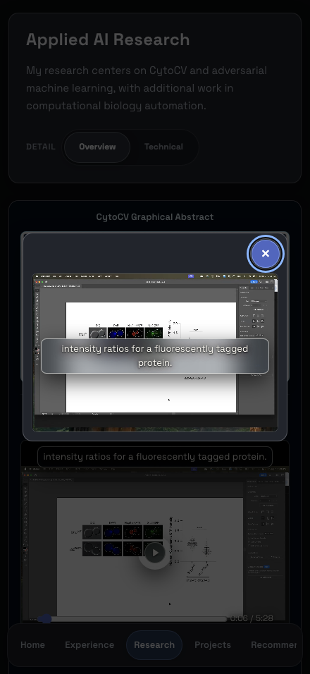
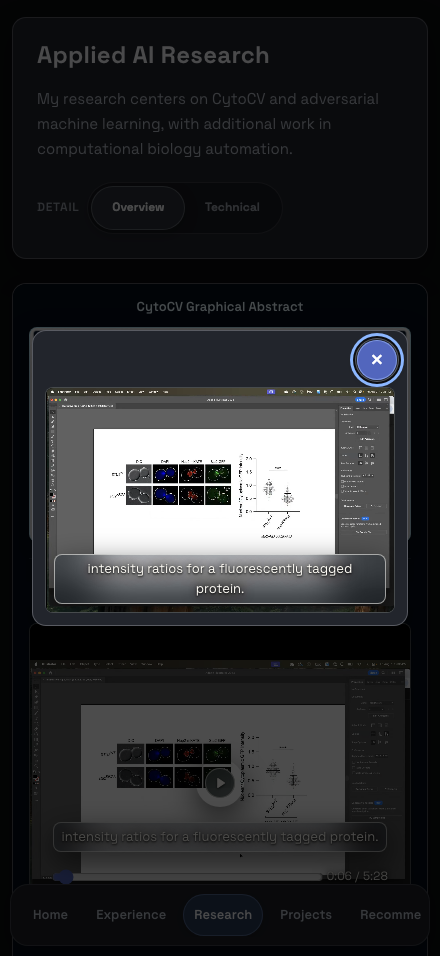
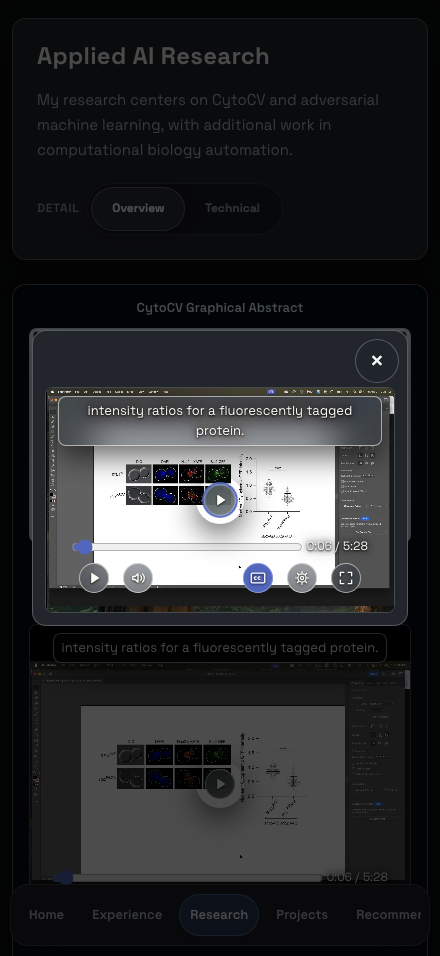
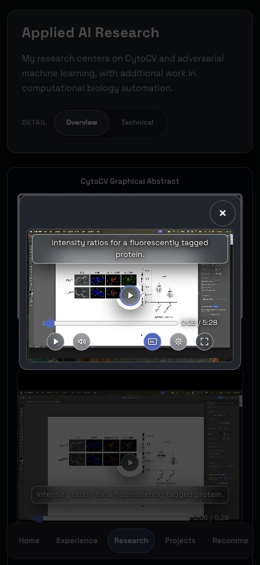
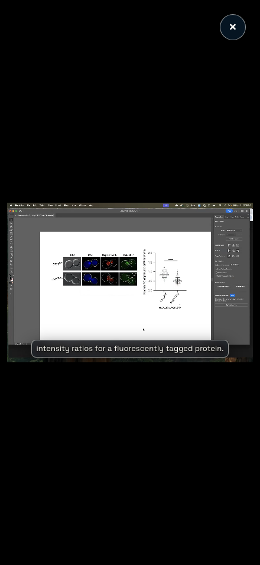
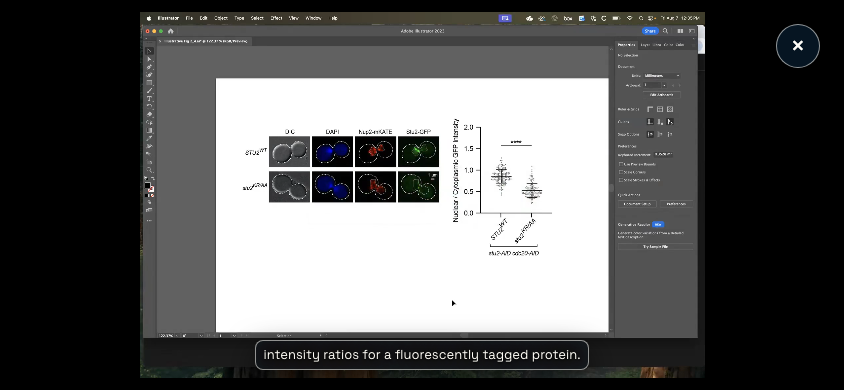

# Mobile video caption evidence

These Chromium captures compare the deployed starting commit `2208b9a4869a7aae4975062dedf9a35d37a819bd` with this branch's local static export. They use the Dark palette and the published cue at six seconds. Portrait captures are 440 × 956 CSS pixels; landscape is 844 × 390. Background page content and scroll positions differ because the local build uses the checked-in content templates.

| Presentation | Before | After |
| --- | --- | --- |
| Popup, controls hidden |  |  |
| Popup, controls visible |  |  |

The site fullscreen fallback keeps the same video element mounted. These captures show captions near the contained picture in both orientations.

These are review captures, not replacements for the Linux skeleton baselines. The automated coverage and commands are documented in [Testing](../../TESTING.md#mobile-research-video-coverage). Physical iPhone Safari testing is pending because no device was available; browser emulation does not validate Safari chrome or hardware safe-area behavior.

## Validation record

The PR validation stages ran on macOS with Node 22.23.3 and the locked dependencies. The complete suites ran once; after correcting two outdated structural/geometry assertions, only their affected tests were repeated.

| Check | Result |
| --- | --- |
| Documentation, ESLint, and TypeScript | Passed; changed test files also passed focused lint after their assertion updates |
| Priority unit/integration suite | 645 of 646 passed initially; the affected security-contract file then passed all 12 tests |
| Priority Chromium browser suite | 130 of 131 passed initially; the affected narrow-touch player case then passed |
| Scoped mobile WebKit suite | All 3 cases passed |
| Production static export | Passed; final after captures above use this build |
| Static export without JavaScript | Chromium native keyboard playback passed; WebKit verified the single visible heading/player, native controls/default captions, and MP4 metadata |
| Linux skeleton pixel comparison | Pending the existing Ubuntu CI gate; no baseline images changed |

The corrected assertions preserve the default portal contract and check idle captions against the painted picture instead of an invisible center-control rectangle. Visible-control clearance assertions remain strict. The mobile matrix and desktop media cases passed in the full browser run.

Headless WebKit did not start native playback with focused Space or pointer actions when JavaScript was disabled. A temporary bare native-video fixture using the same MP4 and captions behaved identically to the site's closed-dialog fallback: metadata loaded without error, but playback stayed paused. Native no-JavaScript playback in Safari therefore remains part of the pending device check; the enhanced WebKit suite did verify ongoing playback across fullscreen entry and exit.
