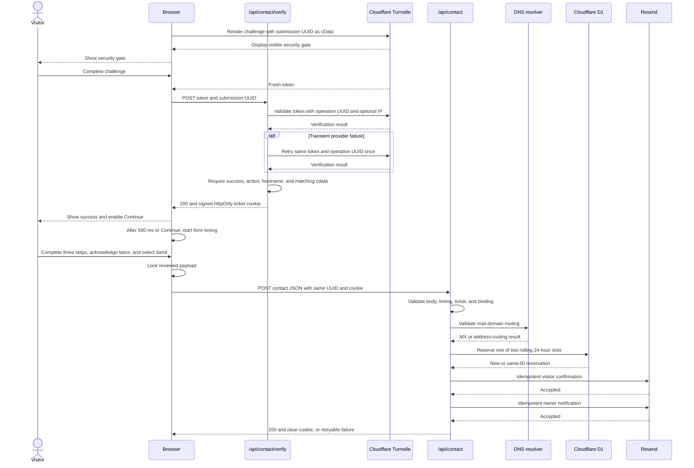

# Contact System

The Contact route is a statically exported page with two narrowly routed Cloudflare Pages Functions. A visible Turnstile gate must succeed before contact fields are shown. Successful verification creates a short-lived signed ticket, and the later delivery request uses that ticket instead of submitting the Turnstile token again.

Use this guide for the complete request contract and trust boundary. See [Security](SECURITY.md) for the broader threat model, [Deployment](../operations/DEPLOYMENT.md) for production setup, and [Local development](../development/LOCAL_DEVELOPMENT.md#complete-contact-flow-development) for local Pages Function testing.

## Source of truth

| Concern | Authoritative source |
| --- | --- |
| Static Contact route and metadata | `src/app/contact/page.tsx` |
| Wizard state, requests, retries, and acknowledgments | `src/components/contact/ContactForm.tsx` |
| Browser field validation | `src/components/contact/contactFormValidation.ts` |
| Turnstile widget options | `src/components/contact/TurnstileWidget.tsx` |
| Shared public contact contract | `functions/_shared/contact.ts` |
| Request, provider, persistence, ticket, and delivery modules | `functions/_shared/contact/` |
| Verification handler | `functions/api/contact/verify.ts` |
| Delivery handler | `functions/api/contact.ts` |
| Function route allowlist | `public/_routes.json` |
| Static response headers | `public/_headers` |
| Production and preview non-secret values | `wrangler.jsonc` |
| Contact-rate reservation schema | `migrations/` |
| Build-time site-key selection | `.github/workflows/ci.yml` |

Implementation and configuration are authoritative when prose differs from the current code.

## Request lifecycle



The two endpoint calls use `credentials: "same-origin"`, so the browser can accept and later send the host-only ticket cookie. Contact fields are not included in the verification request.

## Client experience

### Route and upfront verification

`/contact` is static HTML with a hydrated client form. Its metadata is `noindex, follow`. The route reads `NEXT_PUBLIC_TURNSTILE_SITE_KEY` at build time. When the selected build has no site key, the gate is unavailable and contact fields remain closed.

The explicit Turnstile widget uses:

- action `portfolio_contact`;
- appearance `always`;
- execution `render`;
- the current submission UUID as `cData`;
- flexible sizing;
- light widget styling only for the Light site theme, and dark styling for My mode and Dark;
- manual token refresh and retry behavior so the client controls recovery;
- no hidden Turnstile response field because the token is sent in explicit JSON.

The widget script loads from Cloudflare after hydration and renders a visible gate before contact fields. Expiry, timeout, widget, script, and unsupported-browser callbacks clear the token and fail closed. A valid client token does not open the form by itself: `/api/contact/verify` must accept it and set the signed ticket. Success enables Continue and starts a 500-millisecond transition to the form; the visitor can activate Continue sooner. Failed or expired challenges remain at the gate for an explicit retry.

Each new logical draft receives a cryptographically random submission UUID before the gate. The UUID binds Turnstile custom data, the signed ticket, the reviewed payload, the D1 retry identity, and Resend idempotency keys. When the widget supplies a fresh token, the browser posts only that UUID and token to `/api/contact/verify`. The browser records the form-start time when the form opens automatically or through Continue, so time spent at the gate is not counted as form completion. A later ticket refresh for the same locked delivery preserves the original UUID and form-start time, then returns to locked review without starting delivery.

### Three wizard steps

The progress UI uses steps `1` through `3`:

1. Enter required first and last names.
2. Enter a required email address and message, plus an optional phone number.
3. Review the request and accept both required acknowledgments.

The first acknowledgment permits a response. The second covers the Terms, Privacy Notice, legitimate-inquiry confirmation, and prohibited-material restrictions. The message is limited to 500 characters. Send request remains disabled until both values are true.

Draft contact values live only in React state. The contact form does not read or write local storage or session storage. The hidden `website` field is a honeypot. A direct `mailto:` link remains available when the form or delivery service cannot be used.

Successful delivery replaces the wizard with a standalone completion view. Its <em>Send another message</em> action creates a fresh draft identity and returns to a new gate. Form timing begins only when that gate succeeds and the form opens.

### Submission and retry states

The browser validates and trims the visible fields, freezes the reviewed payload during delivery, and sends the final JSON to `/api/contact` only after `/api/contact/verify` succeeds. It does not send the Turnstile token to the delivery endpoint.

The review Back button, repeat Send actions, and acknowledgment controls are locked while delivery is active. A pre-delivery correction or service result can unlock the form because no email-provider request was made. After a provider or delivery-network failure makes the outcome ambiguous or partial, the browser keeps the reviewed payload locked for safe retry. It preserves the original submission UUID, `startedAt` value, acknowledgments, and byte-equivalent JSON payload. This matches Resend's requirement that a repeated idempotency key use the same request payload.

Client behavior depends on the response:

| Result | Client behavior |
| --- | --- |
| Initial verification succeeds | Retain the UUID, show a brief success state, enable Continue, and open the form after 500 milliseconds or sooner if Continue is activated. |
| Challenge is invalid, expires, or cannot complete | Reset or recreate the visible gate and require an explicit retry. If this is a ticket refresh, preserve the reviewed fields. |
| Verification is transiently unavailable after its bounded retry | Preserve any existing draft, remain at the gate, and show a retryable service notice. No delivery request starts. |
| Delivery returns `verification_required` before any ambiguous or partial delivery | Preserve the draft, return to the gate with the same UUID, and require fresh verification before another delivery attempt. |
| Delivery returns `verification_required` after an ambiguous or partial delivery | Keep the reviewed payload locked and preserve the original UUID and `startedAt`. A fresh token refreshes only the ticket and returns to locked review without auto-delivery. A later explicit retry reuses the UUID so both Resend idempotency keys and the request body remain unchanged. |
| Delivery returns `request_expired` after the two-hour draft limit | Keep the reviewed values visible but stop retrying the stale frozen body. An explicit fresh-request action creates a new UUID, requires a new gate, records a new start time, and rebuilds the payload only after verification. If an earlier attempt was ambiguous, warn that it may have partially delivered before the visitor chooses to start over. |
| Delivery returns `invalid_email` | Return to the editable details step and show the red correction notice. No quota slot or email is created. |
| Delivery returns `rate_limited` | Keep the form editable and show the red rolling-limit notice. Honor the response's `Retry-After` value. |
| DNS validation is temporarily unavailable | Keep the form editable and show a red retry notice. No quota slot or email is created. |
| Configuration or quota storage is unavailable | Show a red service failure notice and fail closed without email delivery. |
| Provider or delivery network failure | Stay on the locked review step and allow a same-payload retry with the current ticket and UUID. |
| Delivery succeeds | Clear the draft and verification state, then show the standalone green completion view including the submitted email address. Create a fresh identity and gate only after the visitor selects <em>Send another message</em>. |

## Endpoint contract

Both handlers use the same request envelope rules:

- HTTP method must be `POST`. Other methods return `405` and `Allow: POST`.
- Required environment configuration is checked immediately after the method, before origin, media-type, or body validation.
- The media type, after removing parameters and normalizing case, must be `application/json`.
- The `Origin` header is mandatory and must exactly match a normalized configured origin. Missing, `null`, malformed, or unlisted origins are rejected. No wildcard and no CORS response are implemented.
- Both handlers enforce a 16,384-byte limit from `Content-Length` when present and from the bytes actually streamed. This happens before JSON parsing completes.
- The byte stream must be valid UTF-8 and valid JSON.
- A configured allowlist is valid only when every comma-separated entry is valid. One malformed origin or hostname makes the corresponding configuration check fail closed.

The handlers apply a 15-second request-body read deadline, but do not implement a whole-request timeout or client-side fetch timeout. Cloudflare platform limits still apply. A body that crosses the 16 KiB input limit or its read deadline begins stream cancellation without waiting for that cleanup to settle. Bounded timeouts apply to Siteverify, mail-domain DNS validation, and each Resend request.

### `POST /api/contact/verify`

The body must be a plain object with exactly these two keys:

| Field | Requirement |
| --- | --- |
| `submissionId` | Trimmed UUID with a supported UUID version and standard variant. |
| `turnstileToken` | Trimmed, non-empty string of at most 2,048 characters without unsafe control characters. |

The handler checks required Turnstile configuration before origin, media-type, and body validation. It sends the token as JSON to `https://challenges.cloudflare.com/turnstile/v0/siteverify` with:

- the server-only secret;
- the token;
- a separate Siteverify operation UUID as `idempotency_key`;
- `CF-Connecting-IP` as `remoteip` only when the header is non-empty, at most 64 characters, and free of unsafe control characters.

Each Siteverify attempt has a 5-second deadline beginning before the request and covering response headers plus streamed JSON parsing. The JSON response is limited to 16 KiB, and the fixed provider request rejects redirects before its secret-bearing body can be forwarded. A network failure, deadline, HTTP `408`, HTTP `429`, HTTP `5xx`, provider `internal-error`, oversized or malformed JSON, or malformed provider response receives one bounded retry of the same token with the same operation UUID. The operation UUID is scoped to that verification operation and is not the submission identity. It is never reused for a new token. Provider configuration, request-contract, and unknown structured errors fail as unavailable without retrying an error that requires operator correction.

A ticket is issued only when the provider response is successful, parses as JSON, contains `success: true`, contains action exactly `portfolio_contact`, reports a hostname in the exact configured allowlist, and returns `cdata` exactly matching the submitted UUID. An invalid or duplicate challenge, or a successful response with an action, hostname, or custom-data mismatch, returns `400 verification_failed`. Exhausted transient failures and provider integration faults return `503 verification_unavailable`. The repository does not inspect `challenge_ts`.

Cloudflare documents Turnstile tokens as single-use, valid for five minutes, and limited to 2,048 characters. See [Turnstile server-side validation](https://developers.cloudflare.com/turnstile/get-started/server-side-validation/).

### `POST /api/contact`

The delivery handler allows only the following keys. Unknown keys are rejected. The client always sends every key; the server permits `phone` to be omitted and normalizes it to an empty string.

| Field | Server requirement |
| --- | --- |
| `submissionId` | Required trimmed UUID matching the signed ticket. |
| `firstName` | Required trimmed text, at most 80 characters. |
| `lastName` | Required trimmed text, at most 80 characters. |
| `email` | Required trimmed address, at most 254 characters. It must have one `@`, a valid local part of at most 64 characters, a dot-bearing DNS-style domain, and a final label containing 2 to 63 ASCII letters or valid supported Punycode. Two-letter suffixes such as `.co` remain valid. After ticket validation, the domain must also advertise a usable mail route through MX or the documented A/AAAA fallback. |
| `phone` | Optional string, trimmed, at most 40 characters. A non-empty value may use the supported international-friendly character set and must contain 7 to 20 digits. |
| `message` | Required text, normalized to line-feed newlines, trimmed, and at most 500 characters. |
| `contactConsent` | Must be boolean `true`. |
| `legalConsent` | Must be boolean `true`. |
| `startedAt` | Required safe integer timestamp in milliseconds. |
| `website` | Required honeypot string, at most 200 characters, and empty after trimming for a legitimate submission. |

Names, phone numbers, messages, and tokens reject unsafe ASCII control characters. Tabs and line endings remain available where their field grammar otherwise permits them. Email addresses reject all whitespace.

The handler evaluates the honeypot and timing signals while parsing the payload, before ticket validation:

- a non-empty honeypot returns generic `200 {"ok":true}` without email delivery;
- completion in less than 1,200 milliseconds returns the same generic success without email delivery;
- a timestamp more than 30 seconds in the future or more than two hours old is invalid;
- normal browser sessions are also limited by the shorter 30-minute verification ticket lifetime.

The browser records `startedAt` only when initial verification has succeeded and the first data-entry step opens, automatically or through Continue. A ticket refresh for an existing locked delivery does not reset it.

The silent success response prevents these low-cost bot signals from becoming a tuning oracle. It also means `200` is intentionally not proof that a honeypot or implausibly fast request produced email.

For a normal verified request, the server performs bounded DNS validation before creating a quota reservation. Each DNS exchange has a 3-second full-operation deadline and a 64 KiB JSON-response limit, and fixed resolver requests reject redirects. An explicit nonexistent domain, null MX, or domain with neither usable MX nor address fallback returns `422 invalid_email`. A timeout, transient resolver failure, oversized response, or indeterminate result returns `503 email_validation_unavailable`. DNS validation establishes domain routing only; it cannot prove that the mailbox exists, is deliverable, or belongs to the submitter.

## Verification ticket

Successful Siteverify validation sets `__Host-portfolio_contact_ticket`. The cookie has:

- `Path=/`;
- `Max-Age=1800`;
- `Secure`;
- `HttpOnly`;
- `SameSite=Strict`;
- no `Domain` attribute, making it host-only.

The ticket payload contains only schema version `1`, the submission UUID, an issued-at timestamp, and an expiry timestamp. It contains no contact fields. The payload is signed, not encrypted, but its contents are opaque identifiers and timing metadata rather than the message or contact details.

The signing key is derived from `TURNSTILE_SECRET_KEY` with domain-separated HKDF-SHA-256, then used for HMAC-SHA-256. No additional ticket secret is configured. The delivery endpoint rejects an absent ticket, duplicate cookie name, malformed or non-canonical encoding, oversized ticket, wrong signature size, invalid signature, wrong version, future-issued ticket beyond the 30-second allowance, altered lifetime, expired ticket, or mismatched submission UUID.

The application has no server-side ticket store, consumed-ticket record, or revocation list. The D1 quota row recognizes a submission UUID only for same-address, same-payload retries, but it is not a record of ticket consumption or final mail delivery. Successful delivery instructs the browser to clear the cookie. A failed delivery leaves it intact until expiry. Provider idempotency, the locked retry payload, exact origin enforcement, and the short lifetime limit duplicate-delivery risk; they do not turn the ticket itself into a database-backed single-use credential. Rotating `TURNSTILE_SECRET_KEY` invalidates outstanding tickets and changes the derived address and payload HMAC keys.

## Mail-domain validation and rolling quota

After payload and ticket validation, the handler validates only the domain portion of the normalized email address through bounded DNS lookups. It prefers MX records and falls back to A and AAAA only when the domain has no MX result. A null MX explicitly rejects mail. Resolver outages fail as a retryable service condition instead of treating the address as invalid.

Before calling Resend, the handler atomically reserves a slot in the `CONTACT_RATE_LIMIT_DB` D1 binding. The `contact_rate_reservations` table contains only:

| Column | Stored value |
| --- | --- |
| `submission_id` | Opaque submission UUID and primary key. |
| `email_hash` | HMAC-SHA-256 of `email.trim().toLowerCase()`. |
| `payload_hash` | HMAC-SHA-256 fingerprint of the normalized full delivery payload. |
| `reserved_at` | Reservation time as Unix epoch seconds. |
| `expires_at` | Rolling-window expiry as Unix epoch seconds. |

The address and payload HMAC keys are derived from `TURNSTILE_SECRET_KEY` with separate domain-separated HKDF contexts. The payload fingerprint includes every normalized delivery field and lets D1 compare retries without storing the field values. No provider-specific dot removal or plus-alias rewriting occurs. D1 never receives the raw email address, name, phone number, or message.

Expired rows are removed during reservation cleanup. Fewer than two unexpired rows for an email hash permits a new reservation; a third returns `429 rate_limited` with `Retry-After` set to the remaining time until the earliest applicable expiry. Reusing the same submission UUID is a free retry only when both the email hash and payload fingerprint match. A mismatch is rejected. A reservation is created before provider delivery and remains after a provider or network failure, while valid same-ID retries consume no additional slot. Missing or unavailable D1 configuration fails closed with `503 service_unavailable`.

## Email delivery and idempotency

After DNS validation and quota reservation, the handler makes up to two sequential `POST https://api.resend.com/emails` requests with server-only bearer authorization and bounded timeouts. Fixed Resend requests reject redirects, and the handler cancels each unread response body without waiting because it needs only the acceptance status. It sends the visitor confirmation first and sends the owner notification only after Resend accepts the confirmation request:

| Message | Destination | Reply-to | Content |
| --- | --- | --- | --- |
| Visitor confirmation | Validated visitor email | Fixed public `CONTACT_REPLY_TO_EMAIL` | Professional navy receipt with submitted name, email, optional phone, message, correction instructions, and absolute Privacy and Terms links. |
| Owner notification | Private `CONTACT_RECIPIENT_EMAIL` | Validated visitor email | Compact name, clickable email, optional phone or “Not provided,” and message. |

Both messages use the configured `CONTACT_FROM_EMAIL` sender. The visitor subject is `I received your message!`; the owner subject is `New contact request from {FirstName} {LastName}` using already validated names. User-controlled HTML is escaped before it enters inline-styled, email-safe HTML, and both messages include plain-text alternatives. The visitor template contains no external images or tracking pixels. For the owner notification, the visitor controls only the validated `reply_to`; the sender, private owner destination, and remaining headers are fixed.

The visitor request uses `Idempotency-Key: portfolio-contact/visitor/<submissionId>` and the owner request uses `Idempotency-Key: portfolio-contact/owner/<submissionId>`. If the owner request fails after visitor acceptance, the browser keeps its locked payload and still-valid ticket; a retry repeats both calls, and the visitor key returns the original accepted result before the owner call is retried. If the ticket expires first, the browser refreshes verification with the original UUID and then repeats the same locked delivery request, preserving both provider keys and the byte-equivalent body. Resend currently documents a 24-hour idempotency window, returns the original result for an identical retry, and rejects reuse of the same key with a different payload. See [Resend idempotency keys](https://resend.com/docs/dashboard/emails/idempotency-keys).

Any network failure, timeout, redirect, or non-success provider response becomes `502 delivery_failed`. The handler reads only what it needs to establish provider acceptance and does not return provider response bodies or email identifiers. Acceptance is not mailbox verification: asynchronous rejection or bounce can still occur after the API call succeeds.

## Responses and headers

| Condition | Status | JSON error |
| --- | ---: | --- |
| Unsupported method | `405` | `method_not_allowed` |
| Missing or invalid required configuration | `503` | `service_unavailable` |
| Missing, malformed, or unlisted origin | `403` | `request_rejected` |
| Media type other than JSON | `415` | `unsupported_media_type` |
| Body over 16 KiB | `413` | `request_too_large` |
| Malformed, timed-out, or invalid JSON request | `400` | `invalid_request` |
| Form draft older than two hours | `409` | `request_expired` |
| Invalid Turnstile challenge or action, hostname, or custom-data mismatch | `400` | `verification_failed` |
| Exhausted transient Turnstile failure or provider integration fault | `503` | `verification_unavailable` |
| Missing, invalid, expired, or mismatched ticket | `401` | `verification_required` |
| Unroutable or null-MX email domain | `422` | `invalid_email` |
| Two active reservations for the normalized address | `429` | `rate_limited`, with `Retry-After` |
| DNS lookup unavailable or indeterminate | `503` | `email_validation_unavailable` |
| Resend failure or timeout | `502` | `delivery_failed` |
| Accepted verification or delivery | `200` | none; body is `{"ok":true}` |
| Honeypot or implausibly fast delivery request | `200` | none; body is `{"ok":true}` without provider delivery |

Every Function response sets:

- `Cache-Control: no-store, max-age=0`;
- `Content-Type: application/json; charset=utf-8`;
- `Referrer-Policy: no-referrer`;
- `X-Content-Type-Options: nosniff`.

Cloudflare Pages does not apply `public/_headers` rules to Function-generated responses. Static pages receive the broader Content Security Policy, Permissions Policy, HSTS, framing, referrer, and content-type protections declared there. See [Cloudflare Pages custom headers](https://developers.cloudflare.com/pages/configuration/headers/).

## Configuration

### Browser build values

| Variable | Exposure and behavior |
| --- | --- |
| `NEXT_PUBLIC_TURNSTILE_SITE_KEY` | Public and compiled into the browser bundle. A blank value makes the form unavailable. |
| `NEXT_PUBLIC_TURNSTILE_PREVIEW_SITE_KEY` | GitHub repository variable used only by CI. The preview build maps it into `NEXT_PUBLIC_TURNSTILE_SITE_KEY`; application code does not read the preview name directly. |

Pull-request builds receive neither deployment site key. Production and preview builds do not fall back to one another.

### Function values

| Variable | Storage | Required by |
| --- | --- | --- |
| `TURNSTILE_SECRET_KEY` | Encrypted Cloudflare secret | Verification and ticket validation for delivery |
| `RESEND_API_KEY` | Encrypted Cloudflare secret | Delivery only |
| `CONTACT_RECIPIENT_EMAIL` | Encrypted Cloudflare secret | Delivery only |
| `TURNSTILE_ALLOWED_HOSTNAMES` | Reviewed Wrangler variable | Verification only |
| `CONTACT_ALLOWED_ORIGINS` | Reviewed Wrangler variable | Both endpoints |
| `CONTACT_FROM_EMAIL` | Reviewed Wrangler variable | Delivery only |
| `CONTACT_REPLY_TO_EMAIL` | Reviewed Wrangler variable | Delivery only |
| `CONTACT_RATE_LIMIT_DB` | Environment-specific D1 binding | Delivery quota and retry identity only |

`/api/contact/verify` can issue a ticket when delivery configuration is unavailable because it requires only the Turnstile secret, valid hostname allowlist, and valid origin allowlist. `/api/contact` does not need the hostname allowlist after a ticket exists, but it still needs the Turnstile secret to verify the ticket signature.

The production Wrangler values allow the assigned Pages hostname, the apex custom hostname, and its `www` hostname with matching HTTPS origins. The preview override allows only the stable `develop` Pages hostname and its HTTPS origin. Production and preview declare separate reviewed D1 database names and live IDs. If either database is deliberately replaced, update only that environment's ID and apply its tracked migrations before deployment. Secret values are configured separately in Cloudflare and are not present in `wrangler.jsonc`, so the repository cannot prove that they exist or are correct in a live environment.

For local testing, copy the placeholder-only example into the ignored local environment file and follow [Local development](../development/LOCAL_DEVELOPMENT.md#complete-contact-flow-development). Do not use production credentials locally.

## Abuse protection: enforced and external controls

### Enforced by repository code

- exact Function route allowlisting;
- POST-only JSON handlers;
- mandatory exact origin;
- streaming body-size and UTF-8/JSON validation;
- strict schemas and unknown-field rejection;
- required acknowledgments and field validation;
- honeypot and completion-time signals;
- one fresh server-side Turnstile validation per new logical message with exact action, hostname, and submission custom data;
- one bounded same-operation retry for transient Siteverify failure;
- signed, short-lived, submission-bound ticket;
- bounded mail-domain DNS validation;
- pseudonymous two-per-address rolling 24-hour D1 quota with keyed retry-payload binding;
- separate provider idempotency keys and locked same-payload retries;
- generic, non-cacheable Function responses.

### External operator requirement

The D1 quota is address-based and therefore does not replace an IP- or network-based edge control. Production also requires an operator-managed Cloudflare rate-limit rule covering both exact paths, normally counted by source IP:

```text
http.request.uri.path in {"/api/contact/verify" "/api/contact"}
```

The live WAF state cannot be verified from this repository. Confirm the deployed rule, threshold, counting characteristic, mitigation timeout, action, and response through the Cloudflare dashboard and a controlled live test.

Do not place an interactive Managed Challenge on either JSON endpoint. The form already presents a visible Turnstile gate before contact fields, and an HTML challenge would add a second gate and change the JSON API response contract.

The browser falls back to a generic failure message when an error response is not valid JSON. That fallback does not make an HTML challenge compatible with the endpoint contract.

Cloudflare documents custom JSON rate-limit block responses as a Pro-plan-or-higher feature. If JSON blocks are required, confirm that the active plan and selected Block action support them. Do not claim a custom JSON edge response on a plan that cannot configure one. See [Cloudflare rate-limit custom responses](https://developers.cloudflare.com/waf/rate-limiting-rules/create-zone-dashboard/#configure-a-custom-response-for-blocked-requests).

## Privacy, storage, and logging

The browser holds the draft in memory. The signed cookie holds only the submission UUID and timing metadata. D1 stores the opaque submission UUID, keyed normalized-email hash, opaque keyed full-payload fingerprint, and reservation and expiry times; it stores no raw contact fields or message. Expired rows stop counting at expiry and are removed during later reservation cleanup. Cloudflare processes request metadata and the verification token; Siteverify also receives the optional Cloudflare-provided IP value. DNS resolution processes the email domain. Resend and the receiving mail systems process the complete email messages and delivery metadata. The visitor confirmation repeats the submitted contact details in email.

There are no explicit `console` calls or request-body logging in the two Functions. This repository-level absence does not disable Cloudflare, Resend, or mailbox-provider logs and retention. Do not add body, token, contact-field, provider-response, recipient, or credential logging. Coarse outcomes and non-sensitive timing are the maximum appropriate application telemetry if logging is added later.

The private recipient is never returned in an endpoint response or included in the browser bundle. The configured sender and fixed reply-to are intentionally public identities and are not substitutes for the private destination inbox.

The direct email link bypasses the two contact Functions, their ticket, and their form-specific validation. Messages sent that way are processed directly by the visitor's and recipient's mail systems.

## Verification coverage and limits

The automated tests cover the visible upfront gate, three data-entry steps, two acknowledgments, 500-character boundary, expiry and error recovery, repeated-click blocking, exact client request bodies, standalone completion, subsequent new messages, notices and locked retries, field validation, Turnstile widget callbacks, handler order, body and schema rejection, origin and configuration failure, action, hostname and custom-data binding, bounded Siteverify retry, ticket signing and tamper checks, DNS outcomes, D1 reservation and concurrency behavior, sequential provider calls, email escaping, idempotent partial-failure retry, route allowlisting, and legal-page disclosures.

Deployment smoke testing performs unauthenticated `GET` requests to both Function paths and requires `405` JSON responses. This proves that both routes are deployed and reject the wrong method. It does not prove live Turnstile validation, cookie acceptance, D1 migration state, DNS behavior, WAF state, Resend delivery, sender-domain verification, recipient correctness, or mailbox receipt.

Useful focused verification:

```powershell
npx --no-install vitest run functions/api/contact/verify.test.ts functions/api/contact.test.ts src/app/contact/contact.test.tsx src/components/contact/TurnstileWidget.test.tsx src/components/contact/contactFormValidation.test.ts
npm run docs:check
```

For a release preview, complete the visible gate and inspect its success transition and Continue fallback, the three data-entry steps, two acknowledgments, the 500-character boundary, final Send state, responsive behavior, and accessibility states without selecting Send request. The gate may consume a Turnstile token, but this inspection must not call `/api/contact`, reserve a D1 quota slot, or send email. Complete end-to-end activation still requires a separately authorized controlled live test on each allowed hostname without printing tokens, contact bodies, recipient values, or provider responses.

## Change rules

When changing either endpoint or the client contract:

1. Update browser and server schemas together.
2. Preserve exact route scoping in `public/_routes.json`.
3. Reassess origin, body, timing, ticket, privacy, logging, and rate-limit behavior.
4. Keep secrets server-only and public site keys environment-specific.
5. Add tests for success, failure, retry, timeout, and generic responses.
6. Update this guide, [Security](SECURITY.md), [Deployment](../operations/DEPLOYMENT.md), and the [Security checklist](SECURITY_CHECKLIST.md).
7. Verify the active Cloudflare and Resend configuration separately from repository tests.
